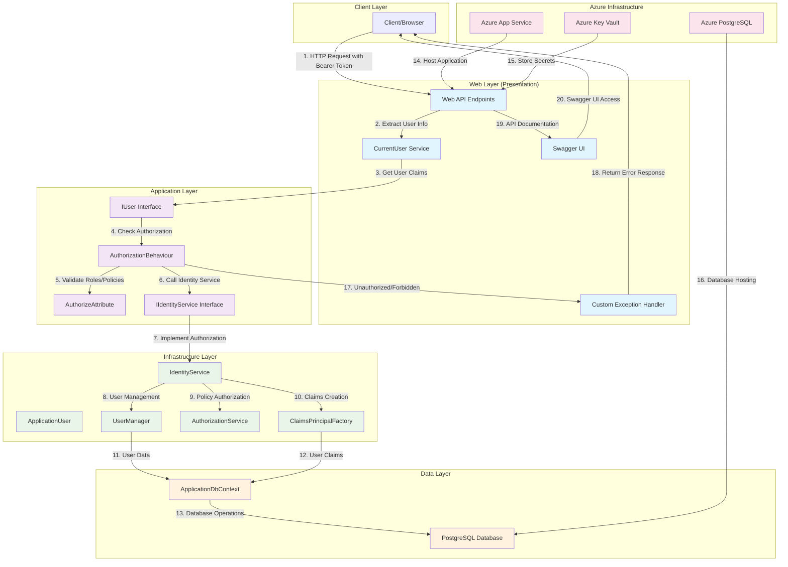

# FHIRAI

FHIRAI là một ứng dụng web được xây dựng theo Clean Architecture pattern, sử dụng ASP.NET Core và được deploy trên Azure cloud infrastructure. Dự án được tạo từ template [Clean.Architecture.Solution.Template](https://github.com/jasontaylordev/CleanArchitecture) version 9.0.12.

## 📋 Mục lục

- [Cấu trúc Dự án](#cấu-trúc-dự-án)
- [Hệ thống Authentication & Authorization](#hệ-thống-authentication--authorization)
- [Cài đặt và Chạy](#cài-đặt-và-chạy)
- [Kiến trúc](#kiến-trúc)
- [Testing](#testing)
- [Deployment](#deployment)

## 🏗️ Cấu trúc Dự án

```
FHIRAI (Clean Architecture)
├── 📁 src/
│   ├── 📁 Application/                    # Application Layer
│   │   ├── 📁 Common/
│   │   │   ├── 📁 Behaviours/            # Cross-cutting concerns
│   │   │   │   ├── AuthorizationBehaviour.cs
│   │   │   │   ├── LoggingBehaviour.cs
│   │   │   │   ├── PerformanceBehaviour.cs
│   │   │   │   ├── UnhandledExceptionBehaviour.cs
│   │   │   │   └── ValidationBehaviour.cs
│   │   │   ├── 📁 Exceptions/
│   │   │   ├── 📁 Interfaces/            # Application contracts
│   │   │   │   ├── IIdentityService.cs
│   │   │   │   ├── IUser.cs
│   │   │   │   └── IApplicationDbContext.cs
│   │   │   ├── 📁 Models/
│   │   │   └── 📁 Security/
│   │   │       └── AuthorizeAttribute.cs
│   │   ├── 📁 TodoItems/                 # Feature modules
│   │   │   ├── 📁 Commands/
│   │   │   ├── 📁 Queries/
│   │   │   └── 📁 EventHandlers/
│   │   ├── 📁 TodoLists/
│   │   └── 📁 WeatherForecasts/
│   │
│   ├── 📁 Domain/                        # Domain Layer
│   │   ├── 📁 Common/
│   │   │   ├── BaseAuditableEntity.cs
│   │   │   ├── BaseEntity.cs
│   │   │   ├── BaseEvent.cs
│   │   │   └── ValueObject.cs
│   │   ├── 📁 Constants/
│   │   │   ├── Policies.cs
│   │   │   └── Roles.cs
│   │   ├── 📁 Entities/
│   │   │   ├── TodoItem.cs
│   │   │   └── TodoList.cs
│   │   ├── 📁 Events/
│   │   ├── 📁 Exceptions/
│   │   └── 📁 ValueObjects/
│   │
│   ├── 📁 Infrastructure/                # Infrastructure Layer
│   │   ├── 📁 Data/
│   │   │   ├── ApplicationDbContext.cs
│   │   │   ├── ApplicationDbContextInitialiser.cs
│   │   │   ├── 📁 Configurations/
│   │   │   └── 📁 Interceptors/
│   │   ├── 📁 Identity/
│   │   │   ├── ApplicationUser.cs
│   │   │   ├── IdentityService.cs
│   │   │   └── IdentityResultExtensions.cs
│   │   └── DependencyInjection.cs
│   │
│   └── 📁 Web/                           # Presentation Layer
│       ├── 📁 Endpoints/
│       │   ├── TodoItems.cs
│       │   ├── TodoLists.cs
│       │   ├── Users.cs
│       │   └── WeatherForecasts.cs
│       ├── 📁 Services/
│       │   └── CurrentUser.cs
│       ├── 📁 Infrastructure/
│       ├── Program.cs
│       ├── DependencyInjection.cs
│       └── appsettings.json
│
├── 📁 tests/                             # Test Projects
│   ├── 📁 Application.FunctionalTests/
│   ├── 📁 Application.UnitTests/
│   ├── 📁 Domain.UnitTests/
│   └── 📁 Infrastructure.IntegrationTests/
│
├── 📁 infra/                             # Infrastructure as Code
│   ├── 📁 core/
│   │   ├── 📁 ai/
│   │   ├── 📁 database/
│   │   ├── 📁 host/
│   │   ├── 📁 monitor/
│   │   ├── 📁 networking/
│   │   ├── 📁 security/
│   │   └── 📁 storage/
│   ├── 📁 services/
│   ├── main.bicep
│   └── main.parameters.json
│
├── FHIRAI.sln
├── global.json
├── Directory.Build.props
└── README.md
```

## 🔐 Hệ thống Authentication & Authorization

### Authentication Flow



### Chi tiết Authentication & Authorization

#### **Authentication Flow:**
1. **Bearer Token Authentication**: Sử dụng ASP.NET Core Identity với Bearer Token
2. **User Context**: `CurrentUser` service trích xuất thông tin user từ HTTP context
3. **Claims Extraction**: Lấy user ID và roles từ JWT claims

#### **Authorization Flow:**
1. **AuthorizationBehaviour**: Middleware kiểm tra authorization cho mỗi request
2. **Role-based Authorization**: Kiểm tra user có role cần thiết không
3. **Policy-based Authorization**: Sử dụng `IIdentityService` để kiểm tra policies
4. **Custom Attributes**: `AuthorizeAttribute` để đánh dấu endpoints cần authorization

#### **Security Features:**
- **Azure Key Vault**: Lưu trữ secrets và connection strings
- **PostgreSQL Database**: Lưu trữ user data và identity information
- **Role-based Access Control**: Administrator role với CanPurge policy
- **JWT Bearer Tokens**: Stateless authentication
- **API Security**: Swagger UI với JWT authentication

#### **Infrastructure:**
- **Azure App Service**: Hosting cho web application
- **Azure PostgreSQL**: Database hosting
- **Azure Key Vault**: Secret management
- **Bicep Templates**: Infrastructure as Code

## 🚀 Cài đặt và Chạy

### Build

Chạy lệnh sau để build solution:

```bash
dotnet build -tl
```

### Run

Để chạy ứng dụng web:

```bash
cd ./src/Web/
dotnet watch run
```

Truy cập https://localhost:5001. Ứng dụng sẽ tự động reload khi có thay đổi trong source code.

### Database Setup

Dự án sử dụng PostgreSQL. Đảm bảo có connection string trong `appsettings.Development.json`:

```json
{
  "ConnectionStrings": {
    "FHIRAIDb": "Server=127.0.0.1;Port=5432;Database=FHIRAIDb;Username=admin;Password=password;"
  }
}
```

## 🏛️ Kiến trúc

### Clean Architecture Pattern

Dự án tuân theo Clean Architecture với 4 layer chính:

1. **Domain Layer**: Chứa business entities, value objects, và domain logic
2. **Application Layer**: Chứa use cases, commands, queries, và application services
3. **Infrastructure Layer**: Chứa external concerns như database, identity, external APIs
4. **Presentation Layer**: Chứa web API endpoints và controllers

### Key Components

- **MediatR**: Implement CQRS pattern
- **AutoMapper**: Object mapping
- **FluentValidation**: Input validation
- **Entity Framework Core**: ORM với PostgreSQL
- **ASP.NET Core Identity**: Authentication và authorization
- **NSwag**: API documentation

## 🧪 Testing

Solution chứa unit tests, integration tests, và functional tests.

Để chạy tests:

```bash
dotnet test
```

### Test Projects

- **Application.UnitTests**: Unit tests cho application layer
- **Domain.UnitTests**: Unit tests cho domain layer
- **Infrastructure.IntegrationTests**: Integration tests cho infrastructure
- **Application.FunctionalTests**: Functional tests cho toàn bộ application

## 🏗️ Code Scaffolding

Template hỗ trợ tạo mới commands và queries.

Bắt đầu từ thư mục `./src/Application/`.

Tạo command mới:

```bash
dotnet new ca-usecase --name CreateTodoList --feature-name TodoLists --usecase-type command --return-type int
```

Tạo query mới:

```bash
dotnet new ca-usecase -n GetTodos -fn TodoLists -ut query -rt TodosVm
```

Nếu gặp lỗi *"No templates or subcommands found matching: 'ca-usecase'."*, cài đặt template:

```bash
dotnet new install Clean.Architecture.Solution.Template::9.0.12
```

## 🚀 Deployment

### Azure Infrastructure

Dự án sử dụng Azure Bicep templates để deploy infrastructure:

- **Azure App Service**: Hosting cho web application
- **Azure PostgreSQL**: Database
- **Azure Key Vault**: Secret management
- **Azure Application Insights**: Monitoring và logging

### Deployment Steps

1. Cài đặt Azure CLI và Azure Developer CLI
2. Đăng nhập vào Azure: `az login`
3. Deploy infrastructure: `azd up`
4. Deploy application: `azd deploy`

## 📝 Code Styles & Formatting

Template bao gồm hỗ trợ [EditorConfig](https://editorconfig.org/) để duy trì coding styles nhất quán cho nhiều developers làm việc trên cùng một project. File **.editorconfig** định nghĩa coding styles áp dụng cho solution này.

## 🆘 Help

Để tìm hiểu thêm về template, truy cập [project website](https://github.com/jasontaylordev/CleanArchitecture). Tại đây bạn có thể tìm thêm hướng dẫn, yêu cầu tính năng mới, báo cáo bug, và thảo luận template với các users khác.